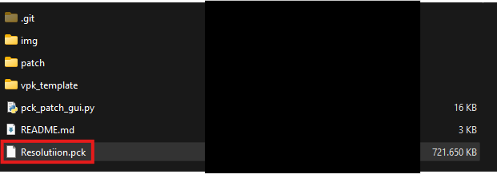
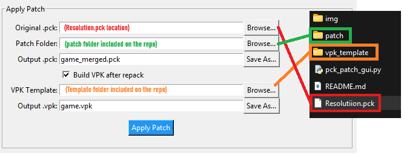
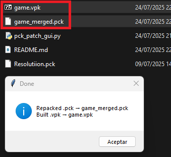
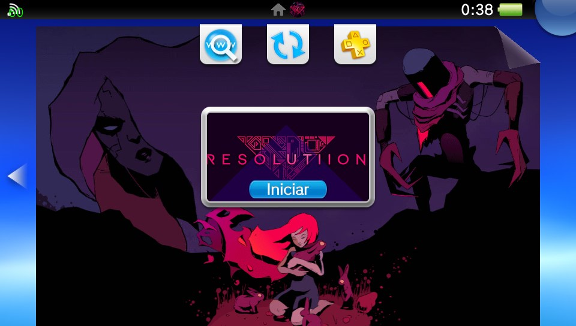

# RESOLUTIION — PSVita Patch

**A patch for _RESOLUTIION_ to run on the PlayStation Vita.**  
An old killer escorts a curious AI into a fractured future of chaotic combat, puzzling secrets, and unsettling calm.

Originally developed in **Godot** by **Monolith of Minds**, _RESOLUTIION_ is a marvelous game, tells the story of Valor and Alibii’s journey through a 2D dreamworld of lovely pixels, dirty jokes and badassemotional tunes, inspired by classic Zelda and similar action-adventure-games. 
More info on their [Website](https://www.monolithofminds.com/resolutiion.html).

---

## 🌐 Official Game Download

- [gog.com](https://www.gog.com/game/resolutiion)  
- [Steam](https://store.steampowered.com/app/975150/Resolutiion/)

---

## 🎮 PSVita Patch Installation Guide

### 1. Download Required Files
- Get the game from [gog.com](https://www.gog.com/game/resolutiion) or [Steam](https://store.steampowered.com/app/975150/Resolutiion/).
- Clone or download this **PSVita patch repository**.

### 2. Prepare the Game Files
- Locate `Resolutiion.pck` in the downloaded game folder.
- Place it inside the patch repository folder.



### 3. Run the Patch Script

Using **Python 3**, execute the following command or double click it to execute it:

```bash
python pck_patch_gui.py
```

Set up the following paths and press **Apply Patch**



Once completed, you'll see:



### 4. Install on Your PSVita

You now have two options:

- **Install via VPK:**  
  Use **VitaShell** to install the generated `game.vpk`.

- **Manual Install:**  
  - Download the game from **VitaDB**.  
  - Replace the `.pck` file in `ux0:data/game_data/` with your `game_merged.pck`, renamed to `game.pck`.



---
## Known issues:

Critical (Must Be Fixed)
- Map functionality is currently broken.
- Memory crash during a specific cinematic (If a map or scene fails to load, please restart the game).

In Progress (Actively Being Worked On)
- Low FPS on certain levels, bosses, and enemies.
- Minor FPS stutters in specific areas.

Nearly Resolved
- Texture and collision mismatches may allow players to access unintended areas.

---
## 📸 Screenshots

Explore the interesting Alibii’s journey :

  
  
  


